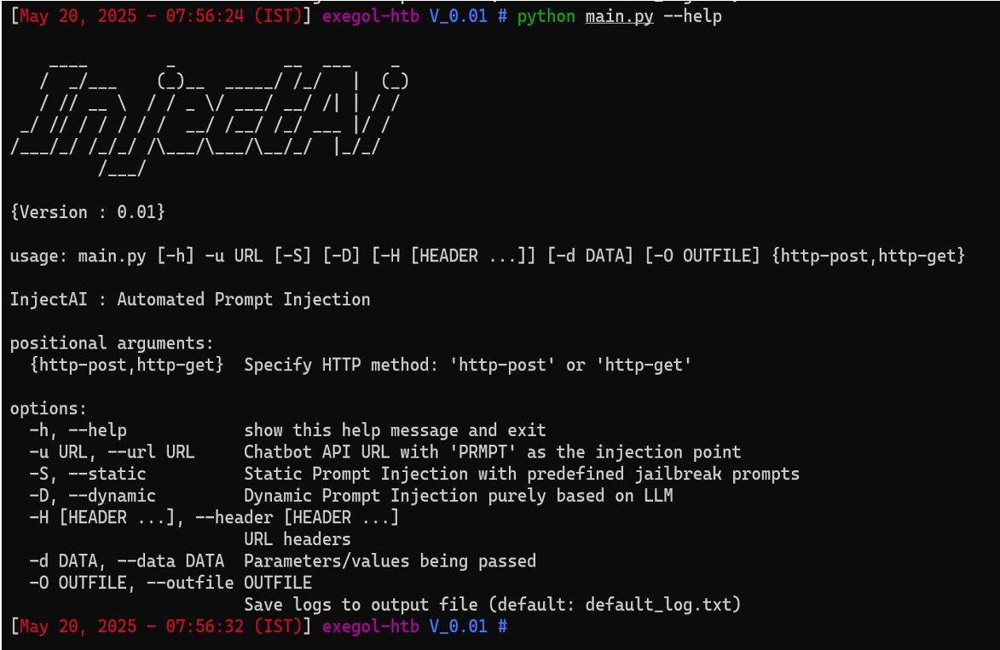

# InjectAI

InjectAI is a penetration testing tool for AI systems, designed to identify and exploit vulnerabilities in machine learning models, pipelines, and deployments.


## Features
- AI model security testing
- Evasion & data poisoning attack simulations
- Automated vulnerability scanning for AI pipelines
- Model extraction & prompt manipulation testing

## Documentation
For a deeper understanding of the project and its design, read the [Report.pdf](Report.pdf).

## Installation
```bash
git clone https://github.com/0x4shWIN/InjectAI.git
cd InjectAI
# Install required dependencies
pip install -r requirements.txt
```
